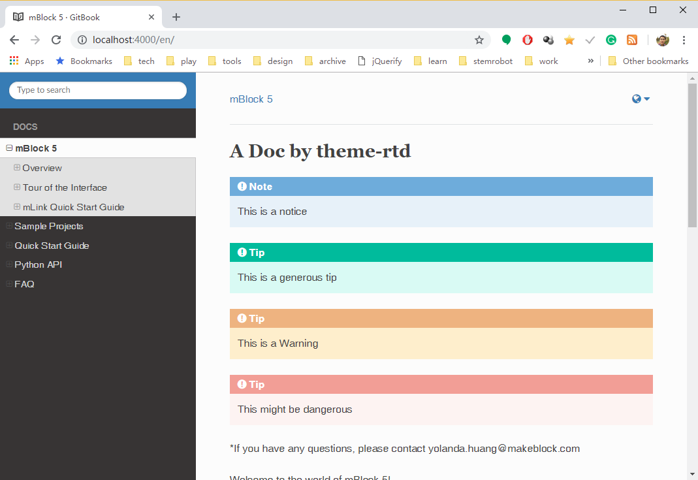

# gitbook-plugin-theme-rtd
a port of Read the Docs theme to Gitbook.

If you like read-the-docs theme, but do not want to play with Sphinx,  
and you think Gitbook toolchain is better than MKDocs,  
this is your choice.

It is still working in progress.  
And this is a "fork" of base theme instead of an extension. That means,  
some other Gitbook plugins may not work. 

Screenshot:



## Features

- A neat sidebar, including the SUMMARY and table of contents of the current page.


## Install

```
{
    "plugins": ["theme-rtd"]
}
```

then `gitbook install`.

## Additional Markups

You may create Tip/Warning boxes use these markups:

```

This is a notice



This is a generous tip



This is a Warning



(Change the title if you wish)



This might be dangerous

```